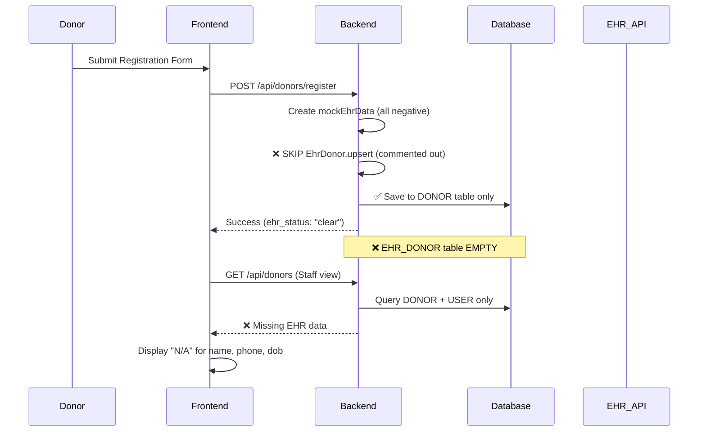

# EHR Donor Integration & Profile Sync Analysis

## Ngày kiểm tra: 27/12/2025

## 1. TÌNH TRẠNG HIỆN TẠI

### ❌ VẤN ĐỀ NGHIÊM TRỌNG

#### 1.1. EHR Sync KHÔNG Hoạt Động

**File**: `backend/src/controllers/DonorRegistrationController.js` (Dòng 100-107)

```javascript
// TEMPORARILY DISABLED: Database schema issue with EHR_DONOR table
// TODO: Fix EHR_DONOR schema - column names mismatch
/*
await EhrDonor.upsert({
  donor_id: userId,
  ...mockEhrData,
});
*/
```

**Vấn đề**:

- ✅ Mock EHR data được tạo với tất cả test results = "negative" (âm tính)
- ✅ `is_clear: true` được set
- ❌ **NHƯNG không được lưu vào database vì bị comment out**
- ❌ Donor profile KHÔNG có thông tin EHR sau khi đăng ký

#### 1.2. DonorList Không Hiển Thị Đầy Đủ Profile

**File**: `frontend/src/pages/staff/DonorList.tsx` (Dòng 123-136)

```tsx
const tableData = donors.map((donor) => ({
  id: donor.donor_id,
  name: donor.user?.email || "N/A", // ❌ Không có tên thật
  dob: formatDate(donor.date_of_birth), // ❌ Không có trong response
  phone: "N/A", // ❌ Không có phone
  ehrId: donor.donor_id.substring(0, 8),
  email: donor.user?.email || "N/A",
  address: donor.address || "N/A", // ❌ Không có trong response
  status: donor.donor_status,
  registeredAt: formatDate(donor.created_at),
  rawData: donor,
}));
```

**Vấn đề**:

- ❌ API `/api/donors` KHÔNG trả về `ehrData` (EHR_DONOR info)
- ❌ Thiếu: `full_name`, `phone`, `date_of_birth`, `address` từ EHR
- ❌ Chỉ hiển thị email thay vì tên thật

#### 1.3. API Response Thiếu EHR Data

**File**: `backend/src/controllers/DonorController.js` (Dòng 18-66)

```javascript
const donors = await Donor.findAndCountAll({
  where: whereClause,
  include: [
    {
      model: User,
      as: "user",
      // ❌ KHÔNG include EhrDonor
      attributes: ["user_id", "email", "role", "is_active", "created_at"],
    },
  ],
  // ...
});
```

**Vấn đề**:

- ❌ `DonorController.getDonors()` không include `EhrDonor` association
- ❌ Frontend không nhận được health screening results
- ❌ Không thể hiển thị is_clear status

## 2. FLOW HIỆN TẠI (BROKEN)



## 3. ĐIỀU PHẢI SỬA NGAY

### 🔧 Fix 1: Bật EHR Sync trong Registration

**File**: `backend/src/controllers/DonorRegistrationController.js`

```javascript
// BEFORE (Line 100-107):
// TEMPORARILY DISABLED: Database schema issue with EHR_DONOR table
/*
await EhrDonor.upsert({
  donor_id: userId,
  ...mockEhrData,
});
*/

// AFTER:
// Create or update EHR record with mock government data
await EhrDonor.upsert({
  donor_id: userId,
  ...mockEhrData,
});

console.log(
  `✅ EHR data synced for donor ${userId}: is_clear=${mockEhrData.is_clear}`
);
```

### 🔧 Fix 2: Include EHR Data trong getDonors API

**File**: `backend/src/controllers/DonorController.js`

```javascript
// Add EhrDonor to include array (after User include)
{
  model: EhrDonor,
  as: "ehrData",
  attributes: [
    "full_name",
    "date_of_birth",
    "phone",
    "email",
    "address",
    "province",
    "district",
    "ward",
    "is_clear",
    "hiv_result",
    "hbv_result",
    "hcv_result",
    "syphilis_result",
    "htlv_result",
  ],
}
```

### 🔧 Fix 3: Update DonorList Frontend Type

**File**: `frontend/src/services/donorAPI.ts`

```typescript
export interface Donor {
  donor_id: string;
  donor_status: string;
  screening_status: string;
  director_status: string;
  created_at: string;
  updated_at: string;

  // Add ehrData
  ehrData?: {
    full_name: string;
    date_of_birth: string;
    phone: string;
    email: string;
    address: string;
    province: string;
    district: string;
    ward: string;
    is_clear: boolean;
    hiv_result: string;
    hbv_result: string;
    hcv_result: string;
    syphilis_result: string;
    htlv_result: string;
  };

  user?: {
    user_id: string;
    email: string;
    role: string;
    is_active: boolean;
  };
}
```

### 🔧 Fix 4: Update DonorList Display

**File**: `frontend/src/pages/staff/DonorList.tsx`

```tsx
const tableData = donors.map((donor) => ({
  id: donor.donor_id,
  name: donor.ehrData?.full_name || donor.user?.email || "N/A", // ✅ Ưu tiên tên thật
  dob: formatDate(donor.ehrData?.date_of_birth), // ✅ Từ EHR
  phone: donor.ehrData?.phone || "N/A", // ✅ Từ EHR
  email: donor.ehrData?.email || donor.user?.email || "N/A",
  address: donor.ehrData?.address || "N/A", // ✅ Từ EHR
  status: donor.donor_status,
  isClear: donor.ehrData?.is_clear || false, // ✅ Health status
  registeredAt: formatDate(donor.created_at),
  rawData: donor,
}));
```

## 4. AUTO-SYNC REQUIREMENTS

### ✅ Mock EHR Data Structure (CORRECT)

```javascript
const mockEhrData = {
  // Personal info
  full_name: fullName,
  date_of_birth: dob,
  phone: phone,
  email: email,
  address: address,
  province: province,
  district: district,
  ward: ward,
  national_id: idPassport,
  source_system: "mock_government_ehr",
  last_fetched_at: new Date(),

  // ✅ All test results = NEGATIVE (pass)
  hiv_result: "negative",
  hiv_sample_date: new Date(),
  hiv_valid_until: new Date(Date.now() + 365 * 24 * 60 * 60 * 1000),
  hbv_result: "negative",
  hbv_sample_date: new Date(),
  hbv_valid_until: new Date(Date.now() + 365 * 24 * 60 * 60 * 1000),
  hcv_result: "negative",
  hcv_sample_date: new Date(),
  hcv_valid_until: new Date(Date.now() + 365 * 24 * 60 * 60 * 1000),
  syphilis_result: "negative",
  syphilis_sample_date: new Date(),
  syphilis_valid_until: new Date(Date.now() + 365 * 24 * 60 * 60 * 1000),
  htlv_result: "negative",
  htlv_sample_date: new Date(),
  htlv_valid_until: new Date(Date.now() + 365 * 24 * 60 * 60 * 1000),

  // ✅ Overall clear status
  is_clear: true,
};
```

### 📋 Production EHR Integration Plan

Khi tích hợp với API EHR thật của nhà nước:

```javascript
// Step 1: Call government EHR API
const ehrResponse = await axios.post(
  "https://ehr.gov.vn/api/get-health-records",
  {
    national_id: idPassport,
    birth_date: dob,
    full_name: fullName,
  }
);

// Step 2: Parse results
const ehrData = {
  ...ehrResponse.data,
  donor_id: userId,
  source_system: "vietnam_national_ehr",
  last_fetched_at: new Date(),

  // Check if ALL tests are negative
  is_clear:
    ehrResponse.data.hiv_result === "negative" &&
    ehrResponse.data.hbv_result === "negative" &&
    ehrResponse.data.hcv_result === "negative" &&
    ehrResponse.data.syphilis_result === "negative" &&
    ehrResponse.data.htlv_result === "negative",
};

// Step 3: Sync to database
await EhrDonor.upsert(ehrData);

// Step 4: Update donor status based on is_clear
if (!ehrData.is_clear) {
  await Donor.update(
    {
      donor_status: "failed_positive",
      screening_status: "rejected",
    },
    {
      where: { donor_id: userId },
    }
  );
}
```

## 5. CHECKLIST HOÀN THÀNH

- [ ] Fix 1: Uncomment `EhrDonor.upsert()` trong DonorRegistrationController
- [ ] Fix 2: Add EhrDonor include trong DonorController.getDonors()
- [ ] Fix 3: Update Donor interface trong donorAPI.ts
- [ ] Fix 4: Update tableData mapping trong DonorList.tsx
- [ ] Fix 5: Add is_clear badge display trong table
- [ ] Test: Đăng ký donor mới và verify EHR data được lưu
- [ ] Test: Staff view donor list có đầy đủ tên, phone, address
- [ ] Test: Health screening status hiển thị đúng

## 6. KẾT LUẬN

**Trạng thái hiện tại**: ❌ CHƯA HOÀN THÀNH

1. ❌ EHR sync bị disable (commented out)
2. ❌ DonorList không nhận được profile đầy đủ từ database
3. ❌ API không trả về ehrData association
4. ✅ Mock data structure đúng (tất cả âm tính, is_clear=true)
5. ✅ EhrDonor model có đầy đủ fields

**Cần làm ngay**: Implement 5 fixes trên để:

- Auto-sync EHR data khi donor đăng ký
- Hiển thị đầy đủ profile trong staff donor list
- Chuẩn bị cho tích hợp EHR API thật của nhà nước
